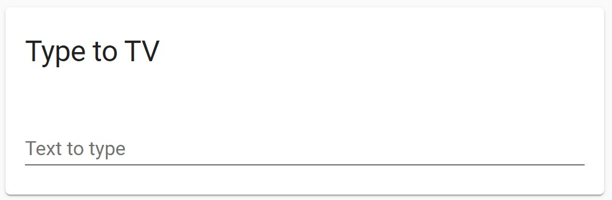

# WebOS Keyboard Input Card for Lovelace/Home Assistant

[](https://buymeacoffee.com/bernikr)
[](https://t.me/bernikr)

This simple card allows you to use your phone or PC keyboard to input text on your LG WebOS TV.

The native [Home Assistant WebOS Integration](https://www.home-assistant.io/integrations/webostv/) is required.



## Install
### Install via HACS
1. Go to the "Frontend"-tab in HACS
2. Click on "Explore & Add Repositories"
3. Search for `WebOS keyboard`
5. Click "Install this Repository in HACS"

### Manual install
1. Copy the `webos-keyboard-card.js` file to your `config/www` folder
2. Add a reference in the resoruce config:

```
resources:
  - url: /local/webos-keyboard-card.js
    type: module
```

## Config
Example config:

```
type: 'custom:webos-keyboard-card'
target: media_player.living_room_tv
title: TV text input
label: Input text here
```

- `target` is the entity id of the WebOS TV media player
- `label` is optional and controlls the placeholder text
- `title` is optional and controlles the card title
